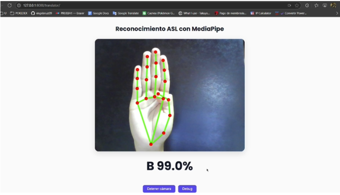

# TRADUCCIÓN DE LENGUAJE DE SEÑAS A TEXTO

> Traductor de Lenguaje de Señas (ASL) a texto en tiempo real usando **MediaPipe Hands** en el navegador, un **modelo CNN TensorFlow** en el backend y **Django** como servidor web.

---

 

---

## 🗂 Contenido

1. [Descripción](#descripción)
2. [Dependencias](#dependencias)
3. [Instalación](#instalación)
4. [Ejecución](#ejecución)
5. [Arquitectura](#arquitectura)
6. [Predicción del modelo](#predicciondelmodelo)
7. [Métricas del modelo](#métricas-del-modelo)
8. [Estructura del repositorio](#estructura-del-repositorio)
9. [Autores](#autores)

---

## Descripción

Este proyecto muestra cómo integrar **detección de manos en el cliente** (WebCam → MediaPipe → ROI) con un **clasificador CNN** entrenado sobre el *ASL Alphabet Dataset* para traducir gestos de la A a la Z en tiempo real.
El flujo es:

```
WebCam → JS/MediaPipe (detección + recorte) → POST /translator/predict_frame/
      → Django → preprocess → CNN (TensorFlow/Keras) → letra → JSON → UI
```

---

## Dependencias

| Componente                            | Versión recomendada |
| ------------------------------------- | ------------------- |
| Python                                | 3.9 – 3.11          |
| Django                                | 4.x                 |
| TensorFlow                            | 2.18.x              |
| OpenCV‑Python                         | 4.8+                |
| MediaPipe (JS)                        | 0.10.x              |


---

## Instalación

## Dataset

- Kaggle: [American Sign Languaje Dataset](https://www.kaggle.com/datasets/ayuraj/asl-dataset)

---

## Configurar la API de Kaggle

1. Ve a tu cuenta de Kaggle → **Account** → **API** → **Create New API Token**.  
2. Se descargará un archivo `kaggle.json`. Súbelo a tu Google Drive si utilizas Google Colaboratory   


##

```bash
# 1. clonar el repositorio
git clone https://github.com/tuusuario/asl_web.git
cd asl_web

# 2. crear entorno virtual
python -m venv .venv
source .venv/bin/activate  # en Windows: .venv\Scripts\activate

# 3. instalar dependencias
pip install -r requirements.txt

# 4. colocar el modelo entrenado
a) descarga `asl_model_final_F1.h5` (≈ 659 MB)
   y copia en  `translator/ml/`

# 5. migraciones (no hay modelos DB)
python manage.py migrate
```
##
 

##
 
 

##


---

## Ejecución

```bash
python manage.py runserver  # http://127.0.0.1:8000/translator/
```

1. Ve a la URL y concede permiso a la cámara.
2. Pulsa **Iniciar cámara**.
3. Coloca la mano dentro del recuadro → la letra aparecerá bajo el vídeo.


---

## Arquitectura

```
translator/
│   views.py          # endpoint /predict_frame/
│   urls.py
│   ml/
│      hand_utils.py  # crop + preprocess + predict
│      asl_model_final_F1.h5
│
└── templates/
        index.html    # UI + JS (MediaPipe)
```

* **Modelo**: CNN de 12 M parámetros, input 150×150×3, 29 salidas (A‑Z, del, nothing, space).
* **Entrenamiento**: ver `Reconomiento_de_señas.ipynb` (Google Colab, 50 epochs, data‑augmentation intensa, accuracy = 100 % en test).

---

## Predicción del Modelo
 

---

## Ejemplos de detección

| Seña | Frame capturado              | Salida |
| ---- | ---------------------------- | ------ |
| A    |  |   |
| B    |  |   |
| C    |  |   |
| D    |  |   |


---

## Visualizacion de la Red en forma Grafica 
 

---

## Métricas del modelo

| Curva de aprendizaje                                   | Matriz de confusión                  | Metricas de Evaluación en Clasificación                                         |
| ------------------------------------------------------ | ------------------------------------ | ---------------------------------------------------- |
|  | | |

*Accuracy en test = 100 %, Recall medio 1.00, F1 1.00*.

---

## Estructura del repositorio

```
.
├── translator/           # app Django
│   ├── ml/
│   │   ├── hand_utils.py
│   │   └── asl_model_final_F1.h5
│   └── templates/
│       └── index.html
├── docs/imgs/            # capturas para README
├── manage.py
└── README.md
```

---

## Autores

* **Nombre 1** • JULIO ANTHONY ENGELS RUIZ COTO , CARNET No. 1284719
* **Nombre 2** • CESAR ADRIAN SILVA PEREZ , CARNET No. 1184519
* **Nombre 3** • EDDIE ALEJANDRO GIRON CARRANZA, CARNET No. 1307419


---
## Link Video Presentacion

- video: [video](https://drive.google.com/drive/folders/1LASNnBFyP_FaF4dVlKb6nehywwHRLEmY?usp=share_link) 

##
  
  Proyecto final – Inteligencia Artificial 2025.
